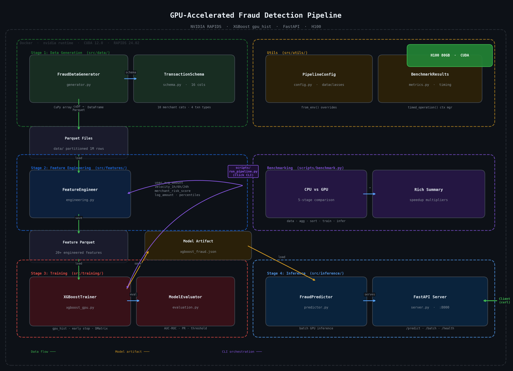

# Fraud Hawk — GPU-Accelerated Fraud Detection Pipeline

## Architecture Diagram



## Architecture Diagram Walkthrough

The diagram is organized into **4 pipeline stages** (left column) plus **supporting modules** (right column), all running inside a Docker container with NVIDIA runtime and CUDA 12.0 on an H100 GPU.

---

### Stage 1: Data Generation (`src/data/`)

**`FraudDataGenerator`** uses CuPy to generate massive arrays on the GPU, then wraps them in a **`TransactionSchema`**-defined cuDF DataFrame (16 columns: transaction IDs, amounts, timestamps, merchant categories, etc.). The synthetic data includes realistic fraud patterns — unusual hours, high amounts, foreign transactions. Output is written as **partitioned Parquet files** (1M rows per partition).

### Stage 2: Feature Engineering (`src/features/`)

**`FeatureEngineer`** loads the Parquet files back into GPU memory and computes 20+ features using cuDF groupby/merge operations:
- **User aggregations** — avg/std/max amount, transaction counts
- **Velocity features** — transaction frequency in 1h, 6h, 24h windows
- **Merchant risk scores** — smoothed target encoding of fraud rate
- **Amount features** — log transform, percentile bins, deviation from user mean

Results are saved as a new **Feature Parquet** file.

### Stage 3: Training (`src/training/`)

**`XGBoostTrainer`** loads the feature Parquet, converts to DMatrix format, and trains with `hist` tree method on CUDA. It uses an 80/20 stratified split, early stopping (50 rounds), and `scale_pos_weight=66` to handle the 1.5% fraud class imbalance. **`ModelEvaluator`** then computes AUC-ROC, precision-recall curves, and optimal thresholds. The trained model is saved as a **Model Artifact** (`xgboost_fraud.json` + `feature_columns.json` sidecar).

### Stage 4: Inference (`src/inference/`)

**`FraudPredictor`** loads the model artifact and performs GPU-accelerated batch predictions. **`FastAPI Server`** wraps it with REST endpoints on port 8000:
- `POST /predict` — single transaction
- `POST /predict/batch` — up to 10K transactions
- `GET /health` — status check
- `POST /threshold` — adjust decision boundary

External clients (curl, apps) hit the server from the right side of the diagram.

---

### Supporting Modules

- **Utils** (top-right) — `PipelineConfig` provides hierarchical dataclass configs with `from_env()` overrides. `BenchmarkResults` tracks timing via a `timed_operation()` context manager.
- **Benchmarking** (middle-right) — `scripts/benchmark.py` runs a 5-stage CPU vs GPU comparison (data gen, aggregations, sorting, training, inference) and outputs a Rich table with speedup multipliers.
- **CLI Orchestration** (center) — `scripts/run_pipeline.py` is a Click CLI that chains stages together. The purple arrows show it driving Stages 1-2-3 via the `run-all` command.

---

### Execution Flow Summary

```
run_pipeline.py run-all -n 10000000
  |
  |-- generate   CuPy -> cuDF -> Parquet (data/)
  |-- features   Parquet -> cuDF groupby/merge -> Feature Parquet
  +-- train      Feature Parquet -> DMatrix -> hist (CUDA) -> model JSON
                                                 |
docker-compose up inference                      |
  +-- FastAPI loads model <----------------------+
        +-- /predict, /batch -> GPU inference -> JSON response
```

Data flows top-to-bottom through the left column (teal arrows), the model artifact bridges training to inference (orange arrows), and the CLI orchestrates everything (purple arrows).
